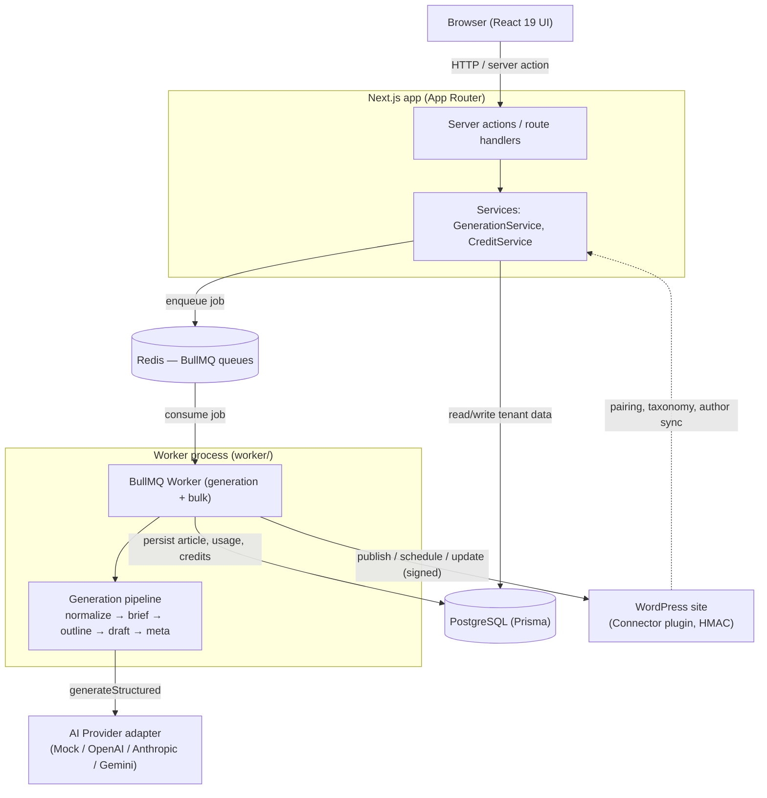

# Architecture

ArticlePilot AI is a **single Next.js 15 application** (App Router, React 19, server actions) backed by PostgreSQL (via Prisma) and Redis (via BullMQ), plus **two out-of-process companions**:

- a **standalone worker** process (`worker/`) that runs AI generation off the HTTP request path, and
- a **PHP WordPress plugin** (`wordpress-plugin/articlepilot-connector/`) that receives signed publish requests.

It is deliberately **not a monorepo**: the web app and worker share the same `src/lib` code and Prisma client, and the plugin is a separate PHP artifact with its own lifecycle.

---

## Data flow



1. The **browser** talks to Next.js through server actions and route handlers. There is no separate API tier.
2. Server actions call **services**, which enforce tenant authorization and read/write PostgreSQL through Prisma.
3. Long-running generation is **enqueued to Redis** (BullMQ) rather than run inline. The HTTP request returns immediately.
4. The **worker** consumes the queue, runs the generation pipeline against the selected **AI provider**, and writes the article, per-step usage, and credit transactions back to PostgreSQL.
5. Publishing sends **HMAC-signed** requests to the WordPress connector plugin.

---

## Layers

### `src/lib/config`
Environment and app configuration. `env.ts` validates the server environment with Zod at boot and **fails fast** on missing/malformed secrets (e.g. `APP_ENCRYPTION_KEY` must be 64 hex chars). `app.ts` holds derived app constants. Import config only from server code.

### `src/lib/ai`
The vendor-neutral AI layer.
- `types.ts` — the **`AIProvider`** interface, the single seam between business logic and any LLM vendor.
- `providers/` — concrete adapters: `mock.ts`, `openai.ts`, `anthropic.ts`, `gemini.ts` (plus `http.ts` helpers).
- `registry.ts` — `getProvider(workspaceId, providerId)` factory. Key precedence: **workspace BYOK credential → platform-managed env key**. Keys are decrypted server-side and never returned to callers.
- `structured.ts` — extracts and **Zod-validates** JSON from raw model output (strips fences/prose); throws a retryable `INVALID_RESPONSE` on failure.
- `cost.ts`, `schemas.ts`, `errors.ts` — cost estimation, pipeline output schemas, and the standardized error taxonomy.

Model metadata lives in the **`AIModel`** registry table (not code): capability flags, context window, pricing in integer USD micro-units, quality/speed tiers.

### `src/lib/generation`
`pipeline.ts` is the controlled generation pipeline: **normalize → brief → outline → draft → meta**. Each stage is a structured, schema-validated provider call. A `fast` path can skip brief/outline. The pipeline is provider-driven and runs fully against the `MockAIProvider`, so it is unit-testable with no key.

### `src/lib/services`
Business orchestration.
- `GenerationService` — orchestrates a full article generation for an `Article` row: ensures quota, charges credits (idempotently), runs the pipeline, records per-step `AIUsage`, persists the article + a version snapshot, and **refunds on failure**.
- `CreditService` — the credit ledger (see below).

### `src/lib/wordpress`
- `ssrf.ts` — validates every user-supplied WordPress URL, resolving the host and rejecting private/loopback/link-local/metadata IPs (DNS-rebind defense).
- `client.ts` — the HMAC-signing plugin client. Re-runs the SSRF check on every call and blocks redirects.

### `src/lib/queue`
BullMQ setup. `connection.ts` provides the shared Redis connection; `queues.ts` defines queue names, job names, **Zod-validated job payloads**, and default retry/backoff options.

### `worker/`
`index.ts` boots BullMQ `Worker`s for the `generation` and `bulk` queues (bounded concurrency), dispatches to `GenerationService`/bulk processors, and shuts down gracefully on `SIGTERM`/`SIGINT`. Jobs persist in Redis, so a restart resumes rather than loses work.

Other supporting layers: `src/lib/auth` (sessions, password hashing, workspace context), `src/lib/crypto` (AES-256-GCM, hashing), `src/lib/prompts` (prompt assembly with a strict trust hierarchy), `src/lib/seo` (HTML sanitize + SEO analysis), `src/lib/articles` (HTML assembly, writing profile).

---

## Multi-tenant isolation

The tenant boundary is the **`Workspace`**. Every tenant-scoped table carries `workspaceId`, and the schema comment makes the rule explicit: rows **must** be filtered by `workspaceId` in the service layer.

Authorization is backend-enforced by **`requireWorkspace(workspaceId, minRole)`** (`src/lib/auth/context.ts`). It resolves the caller's `WorkspaceMember` record and asserts a minimum role using the ranking:

```
OWNER (3) > ADMIN (2) > EDITOR (1) > VIEWER (0)
```

The frontend is never trusted for this check. A user with no membership gets `FORBIDDEN`; platform super-admins reach workspaces only through the separate admin surface, not through `requireWorkspace`.

---

## Credit ledger and idempotency

Billing is an **append-only ledger**, not a mutable counter. `CreditAccount.balance` is kept in lock-step with signed `CreditTransaction` rows inside a **single DB transaction** (`CreditService.apply`). Positive amounts are grants/refunds; negative amounts are charges.

Every mutation accepts an **`idempotencyKey`** (unique-constrained on `CreditTransaction`). If a key has already been applied, `apply` returns the existing `balanceAfter` **without** re-applying the delta. This makes retries safe:

- `GenerationService` charges with `charge:<jobKey>` before running, and refunds with `refund:<jobKey>` on failure.
- BullMQ retries a failed job up to 4 times with exponential backoff; because the keys are stable, a retried job **never double-charges**.
- `BulkJobItem` carries its own unique `idempotencyKey` so a successfully generated item is not regenerated on retry.

This same idempotency principle protects webhook processing (`WebhookEvent.externalId`) and pairing.
